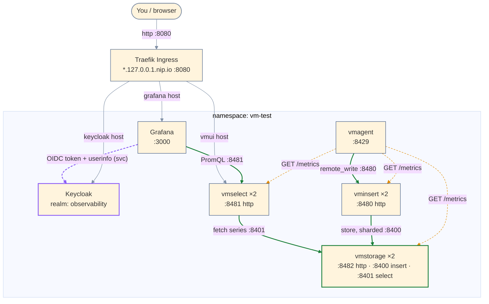
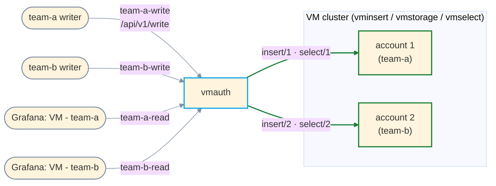

# VictoriaMetrics cluster + Grafana — local test bed (k3d, OpenShift-bound design)

Local test of a Helm-based **VictoriaMetrics cluster** (vminsert/vmselect/vmstorage) +
**Grafana**, run on **k3d** (k3s-in-Docker). The design's real target is an **OpenShift**
production cluster, so the values files are written OpenShift-correct and the k3d run
simulates OpenShift's `restricted-v2` SCC (arbitrary UID + fsGroup) as faithfully as plain
Kubernetes allows.

Pinned chart versions (validated with `helm template`):
- `vm/victoria-metrics-cluster` **0.50.0** (app v1.151.0)
- `vm/victoria-metrics-agent` **0.47.0** (app v1.151.0)
- `vm/victoria-metrics-auth` **0.41.0** (app v1.151.0)
- `grafana/grafana` **10.5.15** (app 12.3.1)
- `codecentric/keycloakx` **7.3.1** (Keycloak 26.7.3)

Access is via **Traefik Ingress** + `*.127.0.0.1.nip.io` hostnames (nip.io resolves to
127.0.0.1, so no `/etc/hosts` edits). A single `kubectl port-forward` to Traefik serves every
UI. Grafana logs in through **Keycloak SSO** (OIDC).

## Architecture & data flow
Scrape (pull) dotted; data write/read solid; access via Traefik; SSO in purple.



- **Scrape (dotted amber)** — vmagent pulls `/metrics` from vminsert/vmselect/vmstorage (and itself); origin of the dashboard's data.
- **Write (green)** — vmagent `remote_write`s to vminsert:8480, sharded to vmstorage over the internal insert port 8400.
- **Read (green)** — Grafana PromQL → vmselect:8481, which fans out to vmstorage over the select port 8401.
- **Access (grey)** — one Traefik port-forward routes by Host to Grafana, vmui, and Keycloak.
- **SSO (purple)** — the browser authenticates at Keycloak *through the ingress host*; Grafana's backend exchanges the code and reads userinfo over the in-cluster Service. That browser-external / backend-internal split is exactly the OpenShift Route model.
- **vmstorage splits insert (8400) and select (8401)** ports — why vminsert/vmselect scale independently.

## What k3d CAN and CANNOT prove
CAN (functional + OpenShift-shaped):
- Chart topology, values, Grafana→vmselect datasource, PVC storage, real query path.
- Workloads tolerate an **arbitrary high UID + gid 0 + fsGroup** (the `-ocp-sim` overlays) —
  the single most common OpenShift runtime failure, incl. Grafana with no root init container.

CANNOT (needs real OpenShift eventually):
- OpenShift's **mutating SCC** that auto-injects UID/fsGroup/caps. Plain k8s never mutates
  pods — its Pod Security Admission only validates. So the *base* files (which deliberately
  leave UID/fsGroup unset for OpenShift to fill in) are run on k3d **with** the sim overlays;
  on real OpenShift you use the base files **alone**.
- **Routes** (k8s has Ingress only) and OpenShift-specific admission/registry behavior.

## Files
| File | Use on |
|---|---|
| `values-vmcluster.yaml` | base — real OpenShift deliverable |
| `values-grafana.yaml` | base — real OpenShift deliverable (nulls UID, disables root init container; provisions the VM cluster dashboard) |
| `values-vmagent.yaml` | base — vmagent scrapes the VM cluster components, remote-writes to vminsert |
| `values-grafana.yaml` also carries the **ingress** + **Keycloak SSO** (generic OAuth) config |
| `values-keycloak.yaml` | base — Keycloak (dev-mode, H2), realm import, ingress |
| `keycloak-realm.json` | realm `observability`: `grafana` OIDC client + roles + test user (imported at startup) |
| `values-vmauth.yaml` | base — vmauth tenant proxy: per-tenant write-only / read-only creds pinned to an account |
| `ingress-vmui.yaml` / `ingress-vmauth.yaml` | Ingress for vmui and for the vmauth tenant entrypoint |
| `values-*-ocp-sim.yaml` (vmcluster / vmagent / grafana / keycloak / vmauth) | **k3d only** overlays — force arbitrary UID + fsGroup |
| `deploy.sh` | creates k3d cluster + installs the whole stack (base + sim) |
| `dashboard-k8s.sh` | installs the Kubernetes Dashboard (live object viewer) + prints a login token |

## 0. Prerequisites
Docker Desktop running, then:
```bash
brew install k3d helm    # kubectl you already have
```

## 1. Deploy
```bash
./deploy.sh
```
Creates k3d cluster `vmtest`, namespace `vm-test`, installs both releases with base + sim overlays.

## 2. Verify
```bash
kubectl get pods -n vm-test          # all Running (as UID 1000700000, no CrashLoop)
kubectl get pvc  -n vm-test          # vmstorage + grafana PVCs Bound
kubectl logs -n vm-test deploy/grafana | grep -i "permission denied"   # expect NOTHING
```

## 3. Access — one port-forward, all UIs (Traefik Ingress)
```bash
kubectl port-forward -n kube-system svc/traefik 8080:80
```
Then open (nip.io hostnames resolve to 127.0.0.1 — no `/etc/hosts` edits):

| UI | URL |
|---|---|
| Grafana | http://grafana.127.0.0.1.nip.io:8080 — **Sign in with Keycloak** |
| vmui | http://vmui.127.0.0.1.nip.io:8080/select/0/vmui/ |
| Keycloak admin | http://keycloak.127.0.0.1.nip.io:8080 (`admin` / `admin`) |
| vmauth (tenant write/read) | http://vmauth.127.0.0.1.nip.io:8080 (basic auth per tenant — see §3c) |

Grafana's **VictoriaMetrics** datasource is pre-wired to vmselect, and the **VictoriaMetrics -
cluster** dashboard is provisioned automatically (Dashboards → VictoriaMetrics folder).

## 3a. Keycloak SSO
Grafana uses Keycloak via OIDC (`[auth.generic_oauth]`). The realm, an OIDC `grafana` client,
roles, and a test user are imported from `keycloak-realm.json` at startup.

- **Test user:** `ashley` / `changeme` — has realm role `grafana-admin` → mapped to Grafana **GrafanaAdmin**.
- **Local fallback login:** the Grafana admin (`admin` / password below) still works at the same page.
```bash
kubectl get secret grafana -n vm-test -o jsonpath="{.data.admin-password}" | base64 -d ; echo
```
- **Role mapping** (`role_attribute_path` in `values-grafana.yaml`): realm roles land in the
  `roles` userinfo claim → `grafana-admin`→GrafanaAdmin, `grafana-editor`→Editor, else Viewer.

**Why the URLs are split** (`values-grafana.yaml`): the browser hits Keycloak's `auth_url`
through the ingress host (`keycloak.127.0.0.1.nip.io:8080`), while Grafana's backend calls
`token_url`/`api_url` over the in-cluster Service (`keycloak-keycloakx-http.vm-test.svc`).
`KC_HOSTNAME_BACKCHANNEL_DYNAMIC=true` lets Keycloak keep a fixed browser-facing issuer while
still answering backchannel calls on the Service name — the same external-vs-internal split
you get with OpenShift Routes.

> Dev shortcuts (not for prod): Keycloak runs `start-dev` with in-memory H2 (state resets on
> restart) and the client secret is a literal in `keycloak-realm.json`. For prod use `start`
> with a real DB and source the secret from a Secret.

## 3b. Kubernetes Dashboard (live pods / StatefulSets / Deployments)
```bash
./dashboard-k8s.sh          # installs it and prints a 24h login token
kubectl --context k3d-vmtest -n kubernetes-dashboard port-forward svc/kubernetes-dashboard-kong-proxy 8443:443
# open https://localhost:8443 (accept self-signed cert), paste the token
```
Regenerate a token later:
`kubectl --context k3d-vmtest -n kubernetes-dashboard create token admin-user --duration=24h`

(On OpenShift you would use the **built-in OpenShift web console** for this instead — no
separate dashboard needed.)

## 3c. Multi-tenancy (vmauth)
VictoriaMetrics separates data by **account ID** carried in the URL path (`/insert/<id>/…`,
`/select/<id>/…`). But **vminsert/vmselect do not authenticate** — anyone who can reach them
can write or read any tenant. **vmauth** is the enforcement layer: each credential is pinned to
a fixed account, and the client cannot override it.



**Tenants:** team-a = account 1, team-b = account 2. Each has **separate write and read creds**:

| Credential | Can do | Routed to | Cannot |
|---|---|---|---|
| `team-a-write` / `team-a-write-pass` | write (`/api/v1/write`, `/api/v1/import*`) | `insert/1` | read, or target account 2 |
| `team-a-read` / `team-a-read-pass` | query | `select/1` | write |
| `team-b-write` / `team-b-write-pass` | write | `insert/2` | read, or target account 1 |
| `team-b-read` / `team-b-read-pass` | query | `select/2` | write |

The account is fixed in `values-vmauth.yaml` (`url_prefix`), so a writer has **no way to name a
tenant** — the tenant isn't in the path it sends. A request matching no `url_map` entry is
rejected, so a write cred can't read and a read cred can't write.

**Grafana** exposes each tenant as its own datasource — **VM - team-a** and **VM - team-b** —
each using that tenant's read cred through vmauth, so a dashboard only ever sees its tenant's data.

Write to a tenant:
```bash
kubectl port-forward -n kube-system svc/traefik 8080:80   # if not already running
curl -u team-a-write:team-a-write-pass --data-binary 'demo_app_requests{svc="api"} 111' \
  http://vmauth.127.0.0.1.nip.io:8080/api/v1/import/prometheus
```

Verified end to end: team-a-read returns only account 1's series, team-b-read only account 2's;
`team-a-write` attempting a read → **400**, `team-a-read` attempting a write → **400**, wrong
password → **401**.

> Hardening for prod (noted, not done here): add a **NetworkPolicy** so only vmauth can reach
> vminsert/vmselect (otherwise a pod could bypass vmauth and hit them directly), and replace the
> plaintext passwords with **bcrypt hashes** or an `existingSecret`.

## 4. Real metrics (vmagent)
`deploy.sh` installs **vmagent** (`values-vmagent.yaml`), which scrapes the VM cluster
components' own `/metrics` (vminsert/vmselect/vmstorage, one `job` each) and remote-writes to
vminsert — this is what populates the **VictoriaMetrics - cluster** dashboard. Verify:
```bash
kubectl --context k3d-vmtest -n vm-test run q --image=curlimages/curl --rm -it -- \
  curl -s 'http://vmcluster-victoria-metrics-cluster-vmselect:8481/select/0/prometheus/api/v1/query?query=count%20by%20(job)%20(vm_app_version)'
# expect vminsert/vmselect/vmstorage/vmagent
```
To scrape more (nodes, cadvisor, annotated pods), extend `config.scrape_configs` in
`values-vmagent.yaml`.

## 5. Tear down
```bash
k3d cluster delete vmtest
```

## When you get OpenShift access
Deploy the **base files only** (drop the `-ocp-sim` overlays — the SCC assigns UID/fsGroup):
```bash
helm install vmcluster vm/victoria-metrics-cluster -f values-vmcluster.yaml -n vm-test
helm install keycloak  codecentric/keycloakx       -f values-keycloak.yaml  -n vm-test
helm install grafana   grafana/grafana             -f values-grafana.yaml   -n vm-test
```
Then adapt for prod:
- Replace Ingress with **Routes** for Grafana / vmui / Keycloak; update the OIDC `auth_url`
  (and Grafana `root_url`) to the Route hostnames. The backend `token_url`/`api_url` can stay
  on the in-cluster Service.
- Keycloak: `start` (not `start-dev`) with a **real database**, and source the client secret
  from a Secret rather than the realm JSON literal.
- prod StorageClass + larger PVC/retention, resource requests/limits, `replicaCount`, vmstorage
  anti-affinity. Re-check `oc get events | grep -i scc`.

## OpenShift fixes already baked into the base files
- **VM cluster**: no override needed — renders empty `securityContext: {}`, so OpenShift's SCC
  fills in a valid UID/fsGroup.
- **Grafana** (defaults fail on `restricted-v2`):
  - pod `securityContext` hardcodes `472` → nulled the UID/GID/fsGroup fields. (Setting `{}`
    does NOT work — Helm merges maps and the 472 survives; the fields must be explicitly null.)
  - `initChownData` is a **root** init container → disabled.
- **Keycloak**: chart default `runAsUser: 1000` / `fsGroup: 1000` → nulled (same fix as Grafana),
  so the SCC assigns them. The quay.io Keycloak image is already OpenShift-arbitrary-UID-safe.
