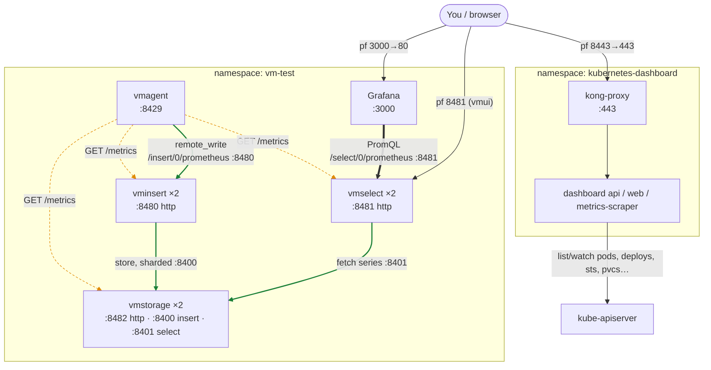

# VictoriaMetrics cluster + Grafana — local test bed (k3d, OpenShift-bound design)

Local test of a Helm-based **VictoriaMetrics cluster** (vminsert/vmselect/vmstorage) +
**Grafana**, run on **k3d** (k3s-in-Docker). The design's real target is an **OpenShift**
production cluster, so the values files are written OpenShift-correct and the k3d run
simulates OpenShift's `restricted-v2` SCC (arbitrary UID + fsGroup) as faithfully as plain
Kubernetes allows.

Pinned chart versions (validated with `helm template`):
- `vm/victoria-metrics-cluster` **0.50.0** (app v1.151.0)
- `grafana/grafana` **10.5.15** (app 12.3.1)

## Architecture & data flow
Scrape (pull) paths dotted; data write/read (push/query) paths solid.



- **Scrape (dotted)** — vmagent pulls `/metrics` from vminsert (8480), vmselect (8481), vmstorage (8482) and itself (8429); origin of the dashboard's data.
- **Write (green)** — vmagent `remote_write`s to vminsert:8480, which shards to vmstorage over the internal insert port 8400.
- **Read (green)** — Grafana PromQL → vmselect:8481, which fans out to every vmstorage over the select port 8401, merges, returns.
- **vmstorage splits insert (8400) and select (8401)** ports — why vminsert/vmselect scale independently.
- **Kubernetes Dashboard** talks to the kube-apiserver (live objects), not to VictoriaMetrics. On OpenShift this is replaced by the built-in web console.

## What k3d CAN and CANNOT prove
CAN (functional + OpenShift-shaped):
- Chart topology, values, Grafana→vmselect datasource, PVC storage, real query path.
- Workloads tolerate an **arbitrary high UID + gid 0 + fsGroup** (the `-ocp-sim` overlays) —
  the single most common OpenShift runtime failure, incl. Grafana with no root init container.

CANNOT (needs real OpenShift eventually):
- OpenShift's **mutating SCC** that auto-injects UID/fsGroup/caps. Plain k8s never mutates
  pods — its Pod Security Admission only validates. So the *base* files (which deliberately
  leave UID/fsGroup unset for OpenShift to fill in) are run on k3d **with** the sim overlays;
  on real OpenShift you use the base files **alone**.
- **Routes** (k8s has Ingress only) and OpenShift-specific admission/registry behavior.

## Files
| File | Use on |
|---|---|
| `values-vmcluster.yaml` | base — real OpenShift deliverable |
| `values-grafana.yaml` | base — real OpenShift deliverable (nulls UID, disables root init container; provisions the VM cluster dashboard) |
| `values-vmagent.yaml` | base — vmagent scrapes the VM cluster components, remote-writes to vminsert |
| `values-vmcluster-ocp-sim.yaml` / `values-vmagent-ocp-sim.yaml` | **k3d only** overlays — force arbitrary UID + fsGroup |
| `values-grafana-ocp-sim.yaml` | **k3d only** overlay — forces arbitrary UID + fsGroup |
| `deploy.sh` | creates k3d cluster + installs both (base + sim) |
| `dashboard-k8s.sh` | installs the Kubernetes Dashboard (live object viewer) + prints a login token |

## 0. Prerequisites
Docker Desktop running, then:
```bash
brew install k3d helm    # kubectl you already have
```

## 1. Deploy
```bash
./deploy.sh
```
Creates k3d cluster `vmtest`, namespace `vm-test`, installs both releases with base + sim overlays.

## 2. Verify
```bash
kubectl get pods -n vm-test          # all Running (as UID 1000700000, no CrashLoop)
kubectl get pvc  -n vm-test          # vmstorage + grafana PVCs Bound
kubectl logs -n vm-test deploy/grafana | grep -i "permission denied"   # expect NOTHING
```

## 3. Access (port-forward)
```bash
kubectl port-forward svc/grafana 3000:80 -n vm-test        # http://localhost:3000
kubectl get secret grafana -n vm-test -o jsonpath="{.data.admin-password}" | base64 -d ; echo

# VictoriaMetrics UI (vmui) via vmselect
kubectl port-forward svc/vmcluster-victoria-metrics-cluster-vmselect 8481 -n vm-test
# then open http://localhost:8481/select/0/vmui/
```
Grafana's **VictoriaMetrics** datasource is pre-wired to vmselect — run a query in Explore.
The **VictoriaMetrics → VictoriaMetrics - cluster** dashboard is provisioned automatically
(Dashboards → VictoriaMetrics folder).

## 3b. Kubernetes Dashboard (live pods / StatefulSets / Deployments)
```bash
./dashboard-k8s.sh          # installs it and prints a 24h login token
kubectl --context k3d-vmtest -n kubernetes-dashboard port-forward svc/kubernetes-dashboard-kong-proxy 8443:443
# open https://localhost:8443 (accept self-signed cert), paste the token
```
Regenerate a token later:
`kubectl --context k3d-vmtest -n kubernetes-dashboard create token admin-user --duration=24h`

(On OpenShift you would use the **built-in OpenShift web console** for this instead — no
separate dashboard needed.)

## 4. Real metrics (vmagent)
`deploy.sh` installs **vmagent** (`values-vmagent.yaml`), which scrapes the VM cluster
components' own `/metrics` (vminsert/vmselect/vmstorage, one `job` each) and remote-writes to
vminsert — this is what populates the **VictoriaMetrics - cluster** dashboard. Verify:
```bash
kubectl --context k3d-vmtest -n vm-test run q --image=curlimages/curl --rm -it -- \
  curl -s 'http://vmcluster-victoria-metrics-cluster-vmselect:8481/select/0/prometheus/api/v1/query?query=count%20by%20(job)%20(vm_app_version)'
# expect vminsert/vmselect/vmstorage/vmagent
```
To scrape more (nodes, cadvisor, annotated pods), extend `config.scrape_configs` in
`values-vmagent.yaml`.

## 5. Tear down
```bash
k3d cluster delete vmtest
```

## When you get OpenShift access
Deploy the **base files only** (drop the `-ocp-sim` overlays — the SCC assigns UID/fsGroup):
```bash
helm install vmcluster vm/victoria-metrics-cluster -f values-vmcluster.yaml -n vm-test
helm install grafana  grafana/grafana            -f values-grafana.yaml   -n vm-test
```
Then add: Routes for Grafana/vmui, the prod StorageClass + larger PVC/retention, resource
requests/limits, `replicaCount`, and vmstorage anti-affinity. Re-check `oc get events | grep -i scc`.

## OpenShift fixes already baked into the base files
- **VM cluster**: no override needed — renders empty `securityContext: {}`, so OpenShift's SCC
  fills in a valid UID/fsGroup.
- **Grafana** (defaults fail on `restricted-v2`):
  - pod `securityContext` hardcodes `472` → nulled the UID/GID/fsGroup fields. (Setting `{}`
    does NOT work — Helm merges maps and the 472 survives; the fields must be explicitly null.)
  - `initChownData` is a **root** init container → disabled.
